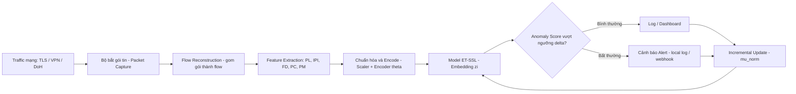
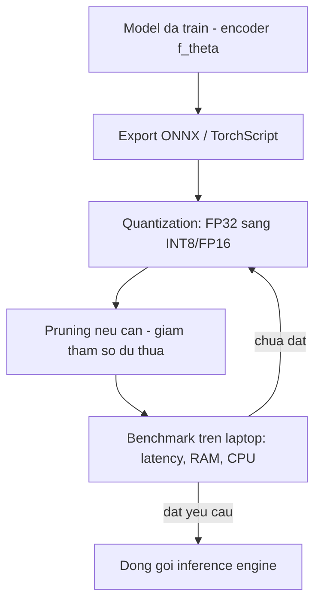

# Edge AI Phát Hiện Bất Thường Lưu Lượng Mạng Mã Hóa
### Flow thiết kế dự án — tham chiếu bài báo ET-SSL (Sattar et al., *Scientific Reports*, 2025)

> Nguồn tham chiếu: "Anomaly detection in encrypted network traffic using self-supervised learning" — DOI: 10.1038/s41598-025-08568-0
> Model gốc trong bài: **ET-SSL** (Encrypted Traffic anomaly detection via Self-Supervised contrastive Learning) — không cần payload decrypt, không cần nhãn, dùng contrastive loss để tách cụm traffic bình thường/bất thường.

**Phạm vi dự án:** chạy toàn bộ trên laptop, không triển khai/test trên thiết bị edge vật lý (Raspberry Pi, Jetson...). "Edge AI" ở đây được hiểu theo hướng **thiết kế model/pipeline nhẹ, tối ưu để phù hợp triển khai edge trong tương lai**, còn thực nghiệm thì đo trên laptop và báo cáo dưới dạng phân tích/ước lượng.

---

## 0. Tóm tắt kiến trúc tổng thể



**3 khối chính của ET-SSL (theo bài báo, mục "Methodology"):**
1. **Feature extraction** — trích đặc trưng thống kê/thời gian từ flow mã hóa (không giải mã payload).
2. **Contrastive representation learning** — encoder học embedding sao cho traffic bình thường tụ gần nhau, bất thường bị đẩy ra xa.
3. **Anomaly detection + incremental learning** — tính khoảng cách tới tâm cụm bình thường `μ_norm`, so với ngưỡng `δ`, và cập nhật `μ_norm` theo thời gian để thích nghi traffic mới.

Con số tham chiếu từ bài báo (chạy trên RTX 3090) để bạn đặt mục tiêu so sánh — không kỳ vọng đạt y hệt trên laptop, chỉ dùng làm đường tham chiếu (baseline) khi viết báo cáo:

| Chỉ số | Giá trị trong bài (server GPU) |
|---|---|
| Accuracy | 96.8% (CIC-Darknet2020) |
| TPR / FPR | 92.7% / 1.2% |
| Latency | 15–25 ms |
| Throughput | tới 10 Gbps / ~1500–1900 flows/s |
| Năng lượng | ~0.5 J/detection |
| Zero-day TPR | ~90%, FPR ~5% |

→ Mục tiêu thực tế trên laptop: **giữ được accuracy trong khoảng 90–95%**, đo latency/throughput/CPU/RAM thật trên máy bạn, và **tối ưu hóa model (quantization/pruning) như một bài toán phân tích hiệu năng**, chứng minh model *có tiềm năng* chạy trên thiết bị công suất thấp — không cần deploy thật.

---

## 1. Giai đoạn 1 — Chuẩn bị dữ liệu & đặc trưng

- [ ] **Chọn dataset** (giống bài báo để so sánh kết quả):
  - CIC-Darknet2020 — https://www.kaggle.com/datasets/dhoogla/cicdarknet2020
  - ISCX VPN-nonVPN (VNAT) — https://www.ll.mit.edu/r-d/datasets/vpnnonvpn-network-application-traffic-dataset-vnat
  - UNSW-NB15 — https://www.kaggle.com/datasets/dhoogla/unswnb15
- [ ] **Làm sạch dữ liệu**: loại bỏ flow thiếu/hỏng, chuẩn hóa numeric feature (giống bài báo: scaling để tránh chênh lệch biên độ).
- [ ] **Trích 5 nhóm đặc trưng flow-level** (không đụng payload):
  - `Packet Length distribution (PL)`
  - `Inter-Packet Interval (IPI)`
  - `Flow Duration (FD)`
  - `Packet Count (PC)`
  - `Protocol Metadata (PM)`
- [ ] **Chia tập**: train 70% / val 15% / test 15% (theo đúng tỉ lệ bài báo, huấn luyện không cần nhãn — self-supervised).
- [ ] (Tùy chọn, không bắt buộc) Nếu muốn thử traffic thật thay vì chỉ dùng dataset: dùng `tshark`/`nfstream` bắt traffic ngay trên laptop và export flow feature trực tiếp.

**Output của giai đoạn này:** bộ feature vector `x_i ∈ R^d` sẵn sàng đưa vào encoder.

---

## 2. Giai đoạn 2 — Model (bạn đã có sẵn) → chuẩn hóa lại cho pipeline

Vì bạn đã có model ET-SSL (hoặc tương đương), bước này là **rà soát & đóng gói** model để dùng lại được xuyên suốt pipeline, tách biệt khỏi code training:

- [ ] Xác nhận input/output shape của encoder `f_θ(x_i) → z_i`
- [ ] Xuất/lưu:
  - trọng số encoder (`.pt` / `.onnx`)
  - tâm cụm normal `μ_norm` (vector đã học)
  - ngưỡng anomaly `δ`, hệ số nhạy `κ`, decay `α` (cho incremental update)
  - scaler dùng để chuẩn hóa feature (phải giống lúc train)
- [ ] Viết hàm inference thuần (`score = ||f_θ(x) - μ_norm||²`) tách biệt khỏi code training.



---

## 3. Giai đoạn 3 — Tối ưu hóa model (phân tích hiệu năng, chạy trên laptop)

Không deploy lên thiết bị thật, nhưng vẫn thực hiện tối ưu hóa để **chứng minh model đủ nhẹ cho môi trường edge** — đo lường mọi thứ trực tiếp trên laptop.

| Kỹ thuật | Mục đích | Công cụ gợi ý |
|---|---|---|
| **Quantization** (FP32 → INT8/FP16) | Giảm kích thước model, tăng tốc inference CPU | ONNX Runtime, PyTorch Quantization |
| **Pruning** | Loại bớt trọng số/kênh không quan trọng | `torch.nn.utils.prune` |
| **Knowledge Distillation** (tùy chọn) | Train model nhỏ hơn "học" từ model gốc | Teacher-student setup |
| **Format triển khai** | Chạy nhanh, tương thích inference nhẹ | ONNX Runtime (CPUExecutionProvider) |

**Cách mô phỏng ràng buộc "edge" ngay trên laptop, không cần thiết bị thật:**

| Ràng buộc edge thật | Cách giả lập trên laptop |
|---|---|
| CPU yếu, không GPU | Ép inference chạy CPU-only: `CUDA_VISIBLE_DEVICES=""` hoặc ONNX Runtime CPUExecutionProvider |
| RAM giới hạn (1–4GB) | Giới hạn RAM tiến trình bằng Docker: `docker run --memory=1g ...` |
| Số core giới hạn | Giới hạn CPU: `docker run --cpus=2 ...` hoặc `taskset -c 0,1 python inference.py` |
| Tốc độ xử lý chậm hơn phần cứng thật | So sánh **tương đối**: model sau tối ưu nhanh hơn/nhỏ hơn model gốc bao nhiêu %, thay vì so ms tuyệt đối với bài báo |
| Đo năng lượng tiêu thụ | Không đo J/detection thật được → dùng công cụ ước lượng qua CPU RAPL: `pyRAPL`, `powerjoular` (hầu hết CPU Intel/AMD hiện đại hỗ trợ), hoặc bỏ qua chỉ số này và ghi rõ trong giới hạn nghiên cứu |

Kết quả của giai đoạn này nên trình bày dưới dạng: *"model sau quantization giảm X% kích thước, giảm Y% latency trên CPU laptop — cho thấy tiềm năng triển khai trên thiết bị edge công suất thấp"*, thay vì số liệu đo trên phần cứng thật.

---

## 4. Giai đoạn 4 — Pipeline thu thập & suy luận (chạy toàn bộ trên laptop)

```mermaid
sequenceDiagram
    participant NIC as "NIC laptop / file pcap"
    participant Cap as "Packet Capture - libpcap/nfstream"
    participant Flow as "Flow Aggregator"
    participant Feat as "Feature Extractor"
    participant Inf as "Inference Engine - CPU laptop"
    participant Alert as "Alert Manager"

    NIC->>Cap: Goi tin TLS/VPN ma hoa - live hoac replay pcap
    Cap->>Flow: Gom theo 5-tuple - IP src/dst, port, proto
    Flow->>Feat: Flow hoan chinh hoac theo time-window
    Feat->>Inf: Feature vector xi da chuan hoa
    Inf->>Inf: zi = f_theta(xi); tinh khoang cach S toi mu_norm
    Inf-->>Alert: Neu S vuot nguong delta thi gan co bat thuong
    Alert-->>Alert: Ghi log / hien thi dashboard local
    Inf->>Inf: Cap nhat mu_norm dinh ky - incremental learning
```

**Thành phần đề xuất, tất cả chạy local trên laptop:**
- Packet capture: `nfstream` (dễ dùng nhất, export flow feature sẵn) hoặc `tshark` đọc trực tiếp NIC/file `.pcap`
- Traffic đầu vào: có thể **replay file `.pcap` từ dataset** (CIC-Darknet2020, ISCX VPN-nonVPN) để giả lập traffic đến real-time, không cần traffic mạng thật
- Flow aggregation: cửa sổ thời gian (time-window) hoặc theo kết thúc flow (FIN/timeout)
- Inference engine: ONNX Runtime chạy CPU, đo latency mỗi flow
- Cảnh báo: đơn giản hóa thành log file / dashboard nhỏ (ví dụ Streamlit) chạy local — không cần MQTT/broker nếu chỉ có 1 node

---

## 5. Giai đoạn 5 — Đánh giá (benchmark trên laptop, đối chiếu cấu trúc bài báo)

Tái hiện cấu trúc các bảng đánh giá trong bài báo, nhưng đo trên môi trường laptop:

- [ ] **Detection performance**: Precision, Recall, F1, Accuracy, FPR (đối chiếu Bảng 4 trong bài)
- [ ] **Zero-day detection**: thêm attack pattern chưa từng thấy vào test set, đo TPR/F1/latency (đối chiếu Bảng 5)
- [ ] **Scalability trên laptop**: throughput / CPU / RAM theo traffic load tăng dần (đối chiếu Bảng 6, 11)
- [ ] **So sánh baseline**: Random Forest (supervised), K-means (unsupervised) vs. model của bạn (đối chiếu Bảng 8)
- [ ] **Hiệu quả tối ưu hóa**: so sánh model gốc vs. model đã quantize/prune về size, latency, accuracy (thay thế phần "Energy efficiency" của bài báo, vì không đo được năng lượng thiết bị thật)
- [ ] **Robustness / evasion**: test với traffic có obfuscation (padding, timing randomization) (đối chiếu Bảng 12)
- [ ] **Privacy validation**: xác nhận không có bước nào giải mã payload — quan trọng để giữ đúng tinh thần "privacy-preserving" của ET-SSL

---

## 6. Giai đoạn 6 — Thích nghi liên tục (Incremental Learning)

Theo công thức cập nhật tâm cụm trong bài báo:

```
μ_norm^(t+1) = α · μ_norm^(t) + (1-α) · (1/|N|) Σ z_i,  i ∈ N
```

- [ ] Thiết lập chu kỳ cập nhật (ví dụ mỗi N flow mới được xác nhận là "normal")
- [ ] Chỉ cập nhật `μ_norm` bằng traffic **đã được xác nhận bình thường** (tránh model tự "học" luôn cả traffic bất thường vào baseline)
- [ ] Lưu log để có thể rollback nếu drift bất thường xảy ra
- [ ] Test bằng cách chia dataset thành nhiều "đợt" traffic theo thời gian, giả lập traffic drift, xem model có thích nghi tốt không — vẫn hoàn toàn thực hiện được trên laptop bằng dữ liệu offline

---

## 7. Cấu trúc thư mục project đề xuất

```
edge-ai-traffic-anomaly/
├── data/
│   ├── raw/                  # dataset gốc (CIC-Darknet2020, ISCX, UNSW-NB15)
│   ├── processed/            # feature đã trích, đã chuẩn hóa
│   └── scaler.pkl
├── model/
│   ├── encoder.py            # kiến trúc f_θ
│   ├── weights/               # checkpoint gốc (đã có)
│   ├── export_onnx.py
│   └── quantize.py
├── pipeline/
│   ├── capture.py             # đọc pcap / bắt traffic laptop
│   ├── flow_aggregator.py
│   ├── feature_extractor.py   # PL, IPI, FD, PC, PM
│   └── inference.py           # load ONNX, tính S(ti), so ngưỡng δ
├── optimization/
│   ├── benchmark.py           # đo latency, RAM, CPU% trên laptop
│   └── compare_before_after.py # so sánh model gốc vs. đã quantize/prune
├── dashboard/
│   └── app.py                  # dashboard local (Streamlit) hiển thị traffic + cảnh báo
├── evaluation/
│   ├── metrics.py             # Precision/Recall/F1/FPR
│   ├── zero_day_test.py
│   └── drift_simulation.py     # giả lập traffic drift cho incremental learning
├── configs/
│   └── config.yaml            # δ, κ, α, τ, đường dẫn model
└── README.md
```

---

## 8. Lộ trình mốc thời gian gợi ý (6 tuần, chỉ chạy trên laptop)

| Tuần | Công việc chính |
|---|---|
| 1 | Thu thập dataset, làm sạch, trích feature, xác nhận model hiện có chạy đúng offline |
| 2 | Xuất model sang ONNX, benchmark baseline trên laptop (đối chiếu số liệu với bài báo) |
| 3 | Quantization + pruning, so sánh hiệu năng trước/sau trên laptop |
| 4 | Xây pipeline capture (replay .pcap) → flow aggregation → feature extraction → inference real-time |
| 5 | Test zero-day, robustness với evasion traffic; cài incremental learning + giả lập drift |
| 6 | Tổng hợp báo cáo, so sánh với con số trong bài báo, làm dashboard demo |

---

## 9. Ghi chú quan trọng khi triển khai

- **Không giải mã payload ở bất kỳ bước nào** — đây là điểm cốt lõi của ET-SSL và giúp bạn tuân thủ GDPR/HIPAA nếu cần.
- Ngưỡng `δ`, `κ`, `τ`, `α` nên tinh chỉnh lại bằng validation set của chính bạn (không dùng nguyên số liệu bài báo vì dataset/thiết bị khác nhau).
- Nếu accuracy giảm mạnh sau quantization, thử fine-tune lại vài epoch ở độ chính xác thấp hơn (quantization-aware training) thay vì chỉ post-training quantization.
- Vì không test trên thiết bị thật, khi viết báo cáo/đồ án nên nêu rõ trong phần **giới hạn nghiên cứu (limitations)**: kết quả tối ưu hóa và benchmark được đo trên laptop, mô phỏng ràng buộc tài nguyên bằng phần mềm (giới hạn CPU/RAM), chưa kiểm chứng trên phần cứng edge vật lý — đây có thể là hướng phát triển tiếp theo.