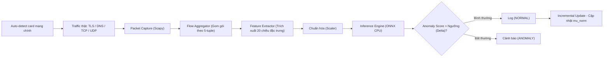

# ET-SSL Edge AI: Traffic Anomaly Detection

Hệ thống phát hiện bất thường lưu lượng mạng mã hóa (Encrypted Traffic Anomaly Detection) dựa trên bài báo **ET-SSL** (*Sattar et al., Scientific Reports, 2025*). Dự án tập trung vào việc trích xuất đặc trưng từ metadata của luồng (flow) mà **không giải mã payload**, sử dụng học sâu (Self-Supervised Learning) để phân loại các luồng mạng bình thường và bất thường theo thời gian thực.

Dự án này đã được triển khai, tối ưu hóa và sửa các lỗi phân mảnh TCP/tính toán thống kê để hoạt động ổn định trên môi trường Linux (Ubuntu/Debian).

---

## 1. Kiến trúc hệ thống



Hệ thống theo dõi các kết nối TCP/UDP, gom chúng thành các `FlowRecord` dựa trên 5-tuple (Src IP, Dst IP, Src Port, Dst Port, Protocol). Khi luồng kết thúc (quá trình bắt tay 4-way FIN hoàn tất, hoặc hết thời gian timeout `120s`), 20 đặc trưng thống kê sẽ được trích xuất và đưa vào mô hình học sâu.

---

## 2. Cài đặt và Yêu cầu

- Hệ điều hành: Linux (khuyên dùng Ubuntu)
- Python: 3.10+
- Môi trường ảo (virtualenv) với các thư viện: `scapy`, `numpy`, `scipy`, `onnxruntime`, `scikit-learn`...

**Cài đặt:**
```bash
python3 -m venv venv
source venv/bin/activate
pip install -r requirements.txt
```

---

## 3. Hướng dẫn sử dụng

### 3.1. Chạy hệ thống bắt gói tin (Live Capture)
Hệ thống cần quyền đọc ghi raw socket để bắt traffic mạng. Script `start.sh` sẽ tự động tìm card mạng chính có kết nối Internet (default route) và bắt đầu quá trình suy luận.

```bash
# Yêu cầu quyền sudo để bắt raw packets
sudo bash start.sh
```

Log của hệ thống được ghi vào:
- `logs/alerts.jsonl`: Mỗi dòng là một kết quả suy luận của một luồng mạng.
- `logs/alerts_summary.json`: Snapshot tổng hợp các chỉ số theo thời gian.
- `logs/pipeline_state.json`: Trạng thái nội bộ của pipeline.

### 3.2. Cân chỉnh lại ngưỡng bất thường (Recalibration)
Ngưỡng phát hiện bất thường (`delta`) được tính toán dựa trên dữ liệu mạng thực tế của môi trường triển khai. Để hệ thống hoạt động chính xác nhất tại nhà/công ty của bạn, hãy chạy script recalibrate (ví dụ trong 5 phút):

```bash
# Chạy cân chỉnh trên giao diện mạng wlp61s0 trong 300 giây (5 phút)
sudo ./venv/bin/python scripts/recalibrate_threshold.py \
    --iface wlp61s0 \
    --duration 300 \
    --percentile 99
```
Script sẽ lắng nghe các luồng mạng "sạch", tự động cập nhật tâm phân phối (`mu_norm.npy`) và ngưỡng giới hạn mới (`delta.npy`), sau đó đồng bộ vào file `config.json`.

---

## 4. Các tối ưu hóa & Fix lỗi cốt lõi (Core Patches) so với nguyên bản

Trong quá trình triển khai, dự án đã khắc phục các lỗi nghiêm trọng về logic mạng và tính toán thống kê để đạt được độ ổn định:

1. **Fix lỗi phân mảnh luồng TCP (FIN/RST Splitting):** 
   - Lỗi cũ: Khi một luồng gặp cờ `FIN` hoặc `RST` đầu tiên, nó lập tức bị ngắt, khiến các gói tin `ACK` phía sau tạo ra các luồng rác (duplicate flow_id).
   - Fix: Triển khai kiểm tra trạng thái **4-way handshake** (cả 2 phía đều phải gửi `FIN`). Đối với `RST`, cho phép luồng tiếp tục bắt các gói tin in-flight sau đó và tự kết thúc qua `flow_timeout_sec`, gộp trọn vẹn kết nối vào một `FlowRecord` duy nhất.

2. **Fix lỗi tràn hệ số biến thiên (Coefficient of Variation - CV Explosion):**
   - Lỗi cũ: Đặc trưng `cov_bwd_payload_bytes_delta_len` tính CV = `std / mean` trên chuỗi chênh lệch (delta) kích thước gói tin. Vì mean của delta tiến dần về 0 (ví dụ `0.01`), việc chia cho mean tạo ra giá trị khổng lồ (hàng nghìn), khiến mô hình xuất ra Anomaly Score lên tới **2.530.000** đối với một số server cụ thể (VD: Microsoft Azure Telemetry).
   - Fix: Kẹp (clip) kết quả CV trong khoảng `[-10.0, 10.0]` (giới hạn an toàn trong thống kê), giữ cho phân phối feature ổn định và triệt tiêu hoàn toàn hiện tượng điểm số bất thường (Score Drop từ 2.5 triệu xuống dải 500 hợp lý).

3. **Cấu hình Timeout cho Long-lived HTTPS:**
   - Tăng `flow_timeout_sec` từ `30s` lên `120s` để tránh việc các kết nối HTTP/2 (Keep-Alive) bị cắt vụn do quá trình Heartbeat, giúp Vector đặc trưng dồi dào và ổn định hơn.

---

## 5. Cấu trúc thư mục

```text
edge-ai-traffic-anomaly/
├── configs/
│   ├── config.yaml            # Cấu hình pipeline (timeout, batch_size...)
│   └── paths.py
├── data/
│   └── feature_schema.py      # Ánh xạ 20 chiều đặc trưng
├── model/
│   ├── weights/               # Chứa mu_norm.npy, delta.npy, model.onnx
│   ├── encoder.py
│   └── inference.py           # Suy luận ONNX & Incremental Learning
├── pipeline/
│   ├── capture.py             # Bắt luồng mạng (Scapy)
│   ├── flow_aggregator.py     # Quản lý hàng đợi và timeouts luồng
│   ├── feature_extractor.py   # Tính toán 20 đặc trưng thống kê luồng (Đã patched)
│   └── inference_runner.py    # Điều phối luồng và cảnh báo
├── scripts/
│   └── recalibrate_threshold.py # Script đo lường và tính ngưỡng (delta) môi trường
├── logs/                      # Log xuất ra thời gian thực
├── start.sh                   # Script khởi chạy toàn bộ hệ thống
└── README.md
```