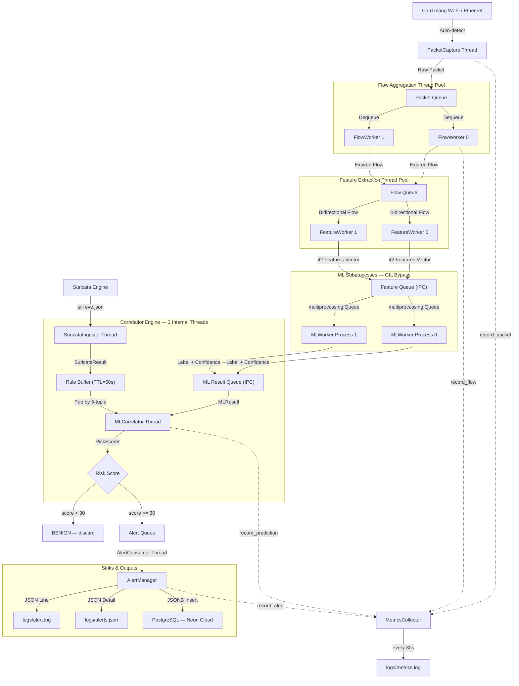

# Modular Network Intrusion Detection System (NIDS/NDR)

Hệ thống phát hiện xâm nhập mạng (NIDS/NDR) thời gian thực được xây dựng bằng Python với kiến trúc modular, đa luồng (Multi-threading) kết hợp đa tiến trình (Multi-processing), tích hợp cơ chế phát hiện dựa trên luật (Suricata) và Học máy (Machine Learning - Random Forest).

---

## 1. Sơ đồ kiến trúc & Luồng dữ liệu (Pipeline Flow)



### Chi tiết luồng xử lý:

1. **Packet Capture** — `capture/scapy_capture.py`
   - Chạy trên một luồng riêng, sử dụng Scapy bắt gói tin IP thô.
   - Tự động dò tìm card mạng đang hoạt động (xem mục 3).

2. **Flow Aggregation** — `flow/flow_manager.py`
   - Gom nhóm gói tin theo 5-tuple `(src_ip, dst_ip, src_port, dst_port, proto)`.
   - Flush flow sang queue khi hết idle timeout (25s) hoặc hard timeout (120s).

3. **Feature Extraction** — `features/feature_extractor.py`
   - Trích xuất **42 đặc trưng** tương thích chuẩn CICFlowMeter.
   - Output là vector số thực để đưa vào mô hình ML.

4. **ML Inference** — `ml/inference.py` + `ml/model_loader.py`
   - Chạy trên các **tiến trình độc lập** (`multiprocessing.Process`) để bypass Python GIL.
   - Giao tiếp qua `multiprocessing.Queue` (IPC thực sự giữa các OS process).
   - Mô hình: `RandomForestClassifier`, scaler: `RobustScaler`, encoder: `LabelEncoder`.
   - Tắt hoàn toàn verbose `[Parallel(...)]` output của joblib qua `model.verbose = 0`.

5. **Correlation Engine** — `correlation/correlation_engine.py`
   - Thiết kế event-driven, non-blocking, 3 luồng nội bộ.
   - Xem chi tiết ở **Mục 2**.

6. **Alert & Persistence** — `alert/alert_manager.py`
   - Ghi `logs/alerts.json` (JSON Lines, đầy đủ chi tiết).
   - Ghi `logs/alert.log` (tóm tắt có cấu trúc cho SIEM).
   - Lưu vào PostgreSQL (Neon Cloud) dưới dạng JSONB.

---

## 2. Detection Correlation Engine

### Kiến trúc song song — Hai engine độc lập

```
         Network Traffic
                |
       +--------+--------+
       |                 |
       v                 v
 Suricata Engine       ML Engine
 (Signature-based)     (Behavioral)
 eve.json tail         RandomForest
       |                 |
       v                 v
 SuricataResult       MLResult
       \               /
        \             /
         v           v
     CorrelationEngine
            |
            v
       RiskScorer
            |
     +------+------+
     |             |
     v             v
  ALERT         BENIGN
```

Hai engine hoạt động **hoàn toàn độc lập** — không block, không phụ thuộc lẫn nhau. Kết quả từ mỗi engine được đưa vào `CorrelationEngine` qua các queue riêng biệt.

### 3 chế độ tính điểm rủi ro (RiskScorer)

| Mode | Điều kiện | Công thức |
|---|---|---|
| **MODE A** — Cả hai engine | Suricata + ML đều có kết quả | `(S×0.75) + (M×conf^1.5×0.25) + boost` |
| **MODE B** — Suricata only | Chỉ Suricata phát hiện | `= Suricata score` (ML không can thiệp) |
| **MODE C** — ML only | Suricata offline/chưa cài | `= score × conf^1.5` nếu `conf ≥ 0.60` |

**Thiết kế trọng số không đối xứng:**
- **Suricata weight = 0.75** — Rule-based, signature đã được xác minh → đáng tin cậy cao.
- **ML weight = 0.25** — Behavioral, xác suất → có thể sai (ví dụ: dự đoán Benign trong khi đang bị DoS).

### Confidence Scaling (Chỉnh điểm ML theo độ tin cậy)

Điểm ML bị nhân với hệ số `confidence^1.5` để phạt các dự đoán không chắc chắn:

| Confidence | Multiplier | Raw Score=80 → Effective |
|---|---|---|
| 95% | ×0.926 | 74.1 |
| 90% | ×0.854 | 68.3 |
| 80% | ×0.716 | 57.2 |
| **70%** | **×0.587** | **46.9** ← không còn bị tính bằng raw score |
| 60% | ×0.465 | 37.2 |
| < 60% | **bỏ qua** | 0 (ML-only mode floor) |

**Ví dụ thực tế:** ML dự đoán Benign với confidence 77% trong khi đang bị DoS → `score=0` → Suricata vẫn thắng và tạo cảnh báo `final=56.2 (LOW)`.

### Rule Confidence Boost (+15 điểm)

Khi cả hai engine cùng nhận diện **cùng một loại tấn công** (ví dụ: Suricata: `PortScan`, ML: `PortScan`), điểm được cộng thêm `+15`, giới hạn tối đa `100`.

### Alert Level

| Risk Score | Level |
|---|---|
| 0 – 30 | **BENIGN** (không cảnh báo) |
| 30 – 60 | **LOW** |
| 60 – 80 | **MEDIUM** |
| 80 – 100 | **CRITICAL** |

### Luồng Suricata (time-windowed buffer)

```
Suricata eve.json
      │
      ▼
SuricataIngester Thread
      │ (push SuricataResult)
      ▼
Rule Buffer (dict)     ← key = 5-tuple, TTL = 60 giây
      │
      ├─── MLCorrelator dò tìm match khi có MLResult
      │
      └─── SuricataFlusher (mỗi 5s): flush các event hết TTL
           → correlate Suricata-only → alert nếu score ≥ 30
```

---

## 3. Logging & Metrics

### Cấu trúc thư mục `logs/` (tại thư mục gốc dự án)

| File | Nội dung | Format |
|---|---|---|
| `nids.log` | Lifecycle, kết nối DB, cấu hình worker | JSON |
| `debug.log` | Chi tiết flow, ML latency (chỉ khi `debug: true`) | JSON |
| `alert.log` | Cảnh báo tấn công tóm tắt — dành cho SIEM | JSON Lines |
| `alerts.json` | Chi tiết đầy đủ mọi cảnh báo | JSON Lines |
| `metrics.log` | Hiệu năng định kỳ (packets, flows, CPU, RAM) | JSON |

### Multi-processing Safe Logging

Tất cả tiến trình con `MLWorker` gửi log về qua `QueueHandler` → `multiprocessing.Queue` → `QueueListener` tại Main Process → `RotatingFileHandler` (100MB/file, giữ 5 backup).

---

## 4. Cơ chế tự động dò tìm Card mạng

Thuật toán 3 lớp tại `capture/scapy_capture.py`:

1. **Default Route** — Đọc `/proc/net/route` để tìm interface đang giữ tuyến `0.0.0.0` (gateway Internet).
2. **Socket Probe** — Mở UDP socket tới `8.8.8.8`, lấy địa chỉ IP nguồn và ánh xạ ngược về tên interface.
3. **Private IP Scan** — Quét tất cả interface, chọn cái đầu tiên có IP thuộc dải `192.168.x.x`, `10.x.x.x`, `172.x.x.x`.

---

## 5. Hướng dẫn vận hành

### Cấu hình (`darktrace-nids/config.yaml`)

```yaml
logging:
  level: INFO          # DEBUG | INFO | WARNING | ERROR
  debug: false         # true = bật debug.log cực chi tiết

flow:
  idle_timeout: 25.0   # giây không hoạt động → flush flow
  sweep_interval: 5.0  # tần suất quét dọn expired flows

workers:
  flow_workers: 2
  feature_workers: 2
  ml_workers: 2

correlation:
  rule_weight: 0.75    # Suricata weight (rule-based → trusted more)
  ml_weight: 0.25      # ML weight (probabilistic → trusted less)
  alert_threshold: 30.0
```

### Kết nối Suricata (`darktrace-nids/.env`)

```env
SURICATA_EVE_JSON=/var/log/suricata/eve.json
```

Nếu Suricata chưa được cài đặt, hệ thống tự động chuyển sang **ML-only mode** và vẫn tạo cảnh báo khi confidence ML đủ cao (≥ 60%).

### Khởi chạy

```bash
sh start.sh
```

Script tự động cấp quyền `CAP_NET_RAW` cho Python binary (không cần chạy `sudo` mỗi lần).

### Theo dõi thời gian thực

```bash
# Cảnh báo tấn công
tail -f logs/alert.log

# Debug chi tiết khi phát triển
tail -f logs/debug.log

# Hiệu năng hệ thống
tail -f logs/metrics.log
```

### Tắt hệ thống

Nhấn `Ctrl+C` — hệ thống sẽ tắt gracefully, đợi tất cả worker dừng sạch trước khi thoát.

---

## 6. Cấu trúc thư mục dự án

```
darktrace-nids/
├── main.py                     # Điểm khởi động duy nhất
├── worker_manager.py           # Điều phối toàn bộ pipeline
├── config.py / config.yaml     # Cấu hình hệ thống
├── capture/
│   └── scapy_capture.py        # Auto-detect interface + bắt gói tin
├── flow/
│   └── flow_manager.py         # Gom nhóm flow theo 5-tuple
├── features/
│   └── feature_extractor.py    # Trích xuất 42 đặc trưng CICFlowMeter
├── ml/
│   ├── inference.py            # MLWorker (multiprocessing)
│   ├── model_loader.py         # Tải model + suppress warnings
│   └── models/                 # model.pkl, scaler.pkl, encoder.pkl
├── correlation/
│   ├── correlation_engine.py   # Event-driven engine (3 luồng nội bộ)
│   ├── risk_score.py           # RiskScorer — confidence scaling
│   ├── models.py               # SuricataResult, MLResult, CorrelationAlert
│   └── thresholds.py           # Ngưỡng, trọng số, severity mapping
├── alert/
│   ├── alert_manager.py        # Ghi log + PostgreSQL
│   └── json_writer.py          # Ghi alerts.json JSON Lines
├── suricata/
│   └── eve_reader.py           # Tail file eve.json thời gian thực
├── nids_queue/
│   └── event_queue.py          # BoundedQueue (thread + multiprocessing)
├── logger/                     # NIDSLogger, QueueListener, MetricsCollector
└── database/
    └── postgres.py             # PostgresWriter — Neon Cloud
```

---

## 7. Yêu cầu hệ thống

| Thành phần | Phiên bản |
|---|---|
| Python | 3.12+ |
| scikit-learn | 1.9.0 |
| scapy | 2.6+ |
| psutil | 6.0+ |
| psycopg2-binary | 2.9+ |
| Suricata *(tùy chọn)* | 7.x |

Cài đặt dependencies:
```bash
pip install -r darktrace-nids/requirements.txt
```
